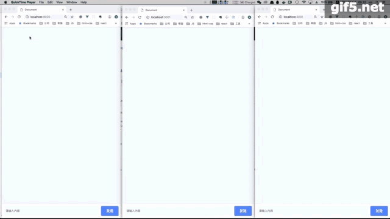

### koa 配合vue 实现聊天室应用

1.从0开始配置vue开发环境

1) 
```
npm init
```
```
yarn add webpack webpack-cli webpack-dev-server vue vue-loader @babel/core @babel/cli 
```
得益于webpack4免配置，webpack 的config 基本不需要写多少
webpack.base.js
```js
# webpack 只展示处理vue部分
...
{
    test: /\.vue$/,
    loader: 'vue-loader'
}
```

### server 部分

socket.io进行 前端和后端的消息传输
```js
yarn add koa socket.io
```

```
const Koa = require('koa')
let app = new Koa
const server = require('http').createServer(app.callback())
const io = require('socket.io')(server)
const fs = require('fs')
const path = require('path')
const static = require('koa-static')

app.use(static(path.resolve(__dirname, '../dist')))
app.use((ctx) => {
    ctx.type = 'html'
    ctx.body = fs.createReadStream(path.resolve(__dirname, '../dist/index.html'))
})
io.on('connection', function(socket){
    console.log(`connection success ${socket.id}`)
    socket.on('chat message', function(msg){
        console.log(msg)
        socket.broadcast.emit('zpzpzpzpzp', {
            name: 'serve',
            val: `${msg}`
        })
    });
});
server.listen(3001, () => {
    console.log(`listenning at 3001`)
})
```
